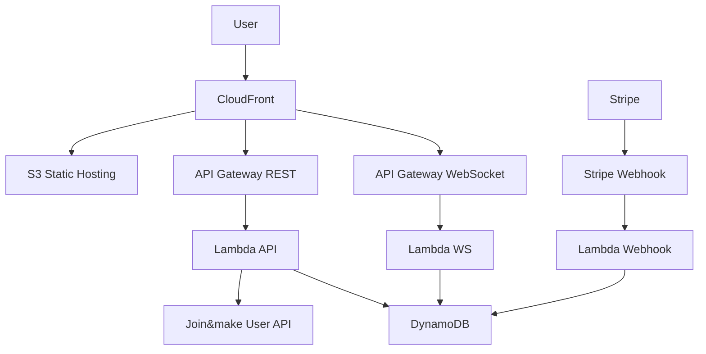
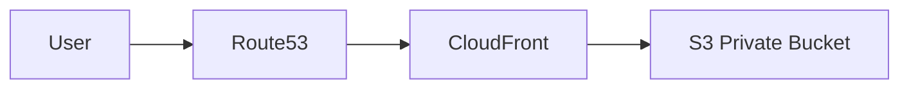
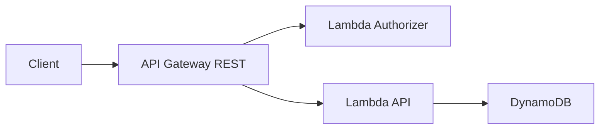
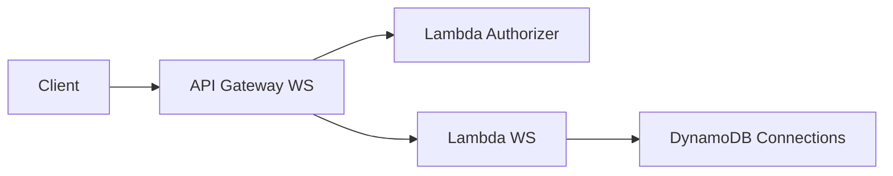
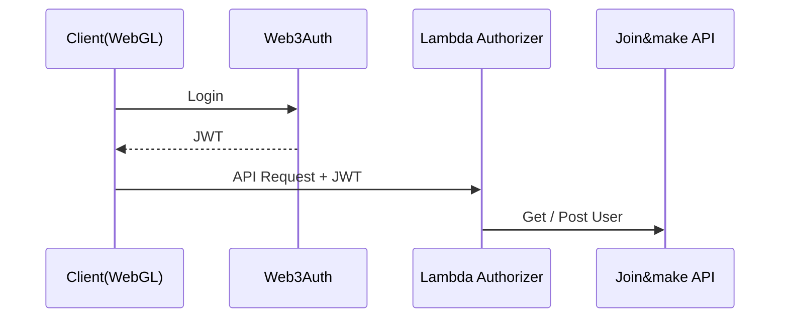
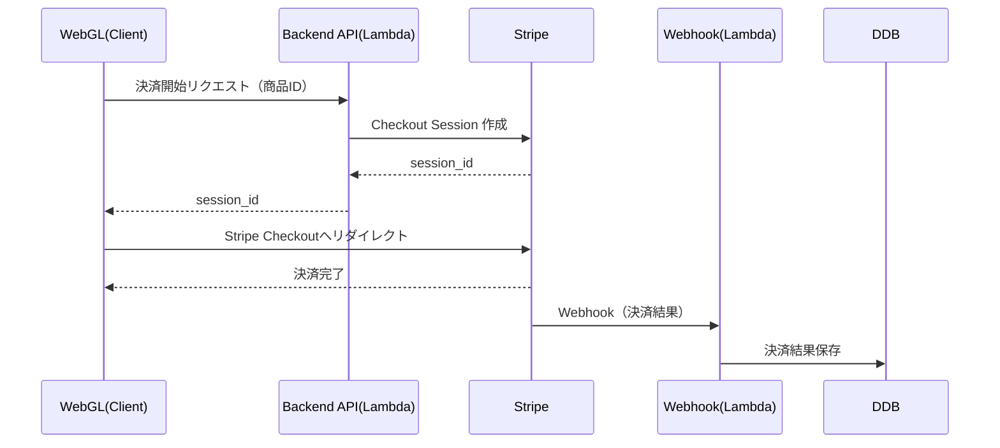
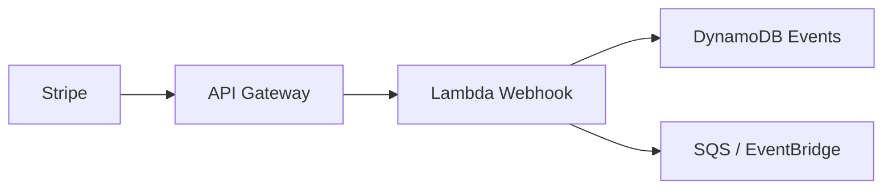
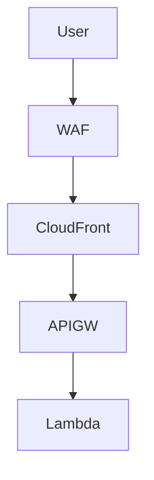
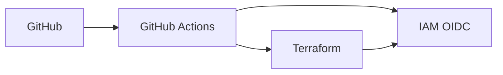

# にゃんこプロジェクト  インフラ設計書

---

## 1. 概要

※基本設計が確定後、更新します。

| 項目 | 内容 |
| --- | --- |
| プロジェクト名 | jm_nyanko |
| クラウド | AWS |
| 基本リージョン | ap-northeast-1（東京） |
| IaC | Terraform |
| CI/CD | GitHub Actions（OIDC） |
| 環境 | Production / Staging（完全スタック分離） |
| プレフィックス | prod_ / stg_ |
| ドメイン | [cat.joinmake.jp](http://cat.joinmake.jp/) |
| NameServer | Route 53 |

---

## 2. Git リポジトリ構成

| --- | --- |
| jm_nyanko_frontend | Unity WebGL |
| jm_nyanko_lp | LP（HTMLのみ） |
| jm_nyanko_backend | Lambda（REST / WS / Webhook） |
| jm_nyanko_iac | Terraform（全インフラ） |

---

## 3. 環境・ドメイン設計

### 環境分離

| 環境 | プレフィックス |
| --- | --- |
| Production | prod_ |
| Staging | stg_ |

### ドメイン

※ドメイン名は仮で記載しています。

| 用途 | Production | Staging |
| --- | --- | --- |
| Frontend / LP | [cat.joinmake.jp](http://cat.joinmake.jp/) | [stg.cat.joinmake.jp](http://stg.cat.joinmake.jp/) |
| REST API | [api.cat.joinmake.jp](http://api.cat.joinmake.jp/) | [api.stg.cat.joinmake.jp](http://api.stg.cat.joinmake.jp/) |
| WebSocket | [ws.cat.joinmake.jp](http://ws.cat.joinmake.jp/) | [ws.stg.cat.joinmake.jp](http://ws.stg.cat.joinmake.jp/) |
| Stripe Webhook | /stripe/webhook | /stripe/webhook |

---

## 4. 全体アーキテクチャ（論理図）

---

## 5. フロントエンド / LP

**使用サービス**

- S3（Private + OAC）
- CloudFront
- ACM（us-east-1）
- WAF
- Route 53

---

## 6. Backend（REST / WebSocket）

### REST API

### WebSocket

---

## 7. 認証・ユーザー管理

- 認証：Web3Auth
- 認可：Lambda Authorizer（JWT検証）
- ユーザー管理：Join&make user API（Post / Get）
- Join&make API は **Lambda からのみ呼び出し**

---

## 8. 決済（Stripe）

### 基本方針

- **決済要求は WebGL（Frontend）から開始**
- **カード情報は一切アプリで扱わない**
- Stripe **Checkout（Hosted Checkout）方式を使用**
- 決済結果の最終確定は **Stripe Webhook を正**とする

---

### 決済フロー

---

### WebGL（Frontend）の責務

**行うこと**

- 決済開始トリガー
- Backend API 呼び出し
- Stripe Checkout へのリダイレクト

**行わないこと**

- Stripe Secret Key 使用
- 金額・通貨の決定
- 決済成功判定

---

### Backend（Lambda）の責務

- Web3Auth JWT 検証
- Join&make user API 呼び出し
- 商品IDから金額・通貨を **サーバ側で確定**
- Stripe Checkout Session 作成
- session_id を返却

---

### Stripe Webhook

**対策**

- Webhook署名検証
- 冪等性（[event.id](http://event.id/)）
- 非同期処理（DLQあり）

---

---

## 9. セキュリティ

- WAF（CloudFront / API Gateway）
- IAM 最小権限
- KMS 暗号化
- Secrets Manager（Stripe / Join&make）
- CloudTrail / GuardDuty

---

## 10. CI/CD（GitHub Actions）

| 環境 | ブランチ | 承認 |
| --- | --- | --- |
| stg | develop | 不要 |
| prod | main | 必須 |

---

## 11. Terraform 管理範囲

- Route 53 / ACM
- S3 / CloudFront / WAF
- API Gateway（REST / WebSocket）
- Lambda
- DynamoDB
- IAM / KMS
- Terraform State（S3 + DynamoDB Lock）

---

## 12. まとめ

- 東京リージョン前提
- 完全サーバレス構成
- prod / stg 完全スタック分離
- Stripe 決済は WebGL 起点 + Webhook
- Terraform による IaC
- セキュリティ重視設計
